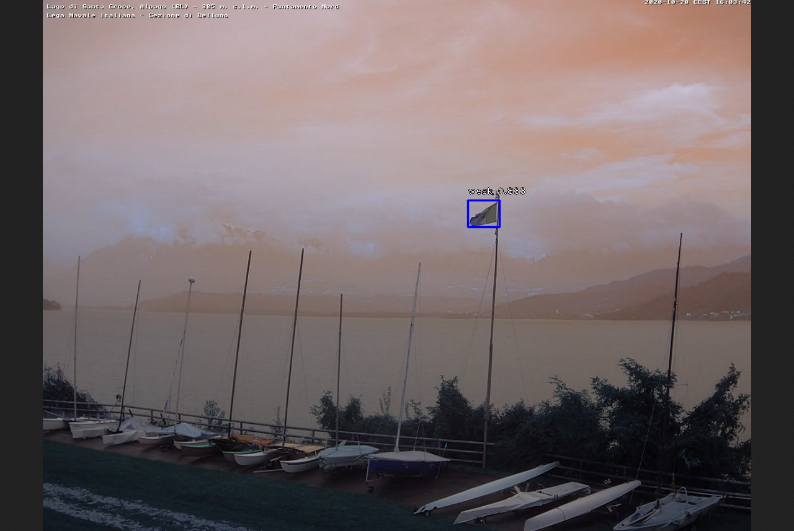

# Introduction

This repository contains a command line utility to predict wind intensity from images, using deep learning. It is able to predict _absent_, _weak_ and _strong_ wind by recognizing wind indicators, such as flags.

# Requirements

- [Install Docker](https://docs.docker.com/install/) on your machine.
- For GPU support on Linux, [install NVIDIA Docker support](https://github.com/NVIDIA/nvidia-docker).

# Setup

Clone the repository

`git clone https://github.com/guglielmoG/windspeed_CLI.git`

cd into the repo

`cd windspeed_CLI`

build the docker image, you may have to use `sudo` when invoking docker

`docker build -t wind .`

this can take some time, as it is setting up the environment. When you are ready, fire up the container

`docker run -it wind bash`

you are presented with a terminal inside the container. Now you can test the utility on a sample image provided with the repo

`python windspeed.py test/img_test.png`

the result is stored by default in `./out`, but see below for more information.

# How It Works

To use the utility, you can just call it by supplying a path 

`python windspeed.py path/to/file/or/folder`

 If _path_ is a folder, it applies the routine on each image within the folder. Internally, the process is divided into three steps:

1. Wind indicators (e.g. flags) are identified within each picture
2. For each indicator, it estimates the probability of _absent_, _weak_ and _strong_ wind **in the image**, based on the information carried by the **single** indicator only
3. It combines estimates from all the indicators to give one final prediction for the overall image

The intuition for the last step is that not all indicators may be perfectly representative of wind intensity, as some could be protected by other objects or another indicator, hence receiving less wind. Averaging helps in reducing this variability.

The result is stored in `./out` by default, but this behavior can be changed by passing the _-o_ flag 

`python windspeed.py test/img_test.png -o some/dir`

The default output is a csv file, `wind_result.csv`, containing wind intensity information for each image at _path_:

```
img_test.png, weak
```

Additionally, one may want to display intermediate steps, namely the visualization of step 1 and step 2 above, this can be done by setting the flag _--show-steps_. In case of _img\_test.png_ for example, one would get

**Step 1**


**Step 2**



For more information on the utility, run
`python windspeed.py -h`

# Advanced

### Videos

In same cases, it may be interesting to predict wind intensity for a video rather than a single or multiple images. This can be easily accomplished by passing the _--video_ flag:

`python windspeed.py test/video_test_1fps.mp4 --video`

Make sure that the file at path is actually a video! Also, notice that for same length videos, the higher the frame rate (fps), the higher the computational cost (greater number of frames to process). You may want to run it using a GPU (see below), or pre-process it to reduce the fps.

Here is a sample output.


Warning: video creation using _opencv_ (the library used in this CLI) is highly reliant on the video codecs installed on the system, therefore the default setting may not be fine for everyone. To modify that, one can specify the pair of _codec_ and _extension_ to be used, for example

`python windspeed.py test/video_test_1fps.mp4 --video --codec mp4v --ext .mp4`

This will create an _.mp4_ output video file encoded using _mp4v_. Another combination usually successful is `--codec MJPG --ext .avi`. Default configuration tested in Windows 10 using VLC and in macOS Catalina. If none of these work, try changing them, or installing corresponding codecs for your platform.

### GPU

To enable GPU computation you need to provide the flag _--gpus all_ to docker run. Please make sure you have [NVIDIA Docker support](https://github.com/NVIDIA/nvidia-docker) installed and that your GPU is among the [supported ones](https://www.tensorflow.org/install/gpu#hardware_requirements).

### Volume Mount

By default, a docker container is isolated from the host system, however it may be useful to exchange data with the image, be this input for the utility, or to retrieve its output. To this end, one can mount a volume in Linux as

`docker run -v /host/path:/docker/path -it wind bash`

Please note that these have to be _absolute_ paths. For example, assuming you cloned the repo in `~`, you could run

```
cd ~/windspeed_CLI
mkdir out
docker run -v ~/windspeed_CLI/out:/app/out -it wind bash
```

For free, you can use the utilities' outputs (stored by default in _./out_) within the host system. Additionally, you can provide input to the utility by placing them in _out_.

For Windows Home edition running Docker 19.03 (and possibly all Docker versions reliant on WSL2), the command is similar

`docker run -v D:\path\to\folder:/app/out -it wind bash`